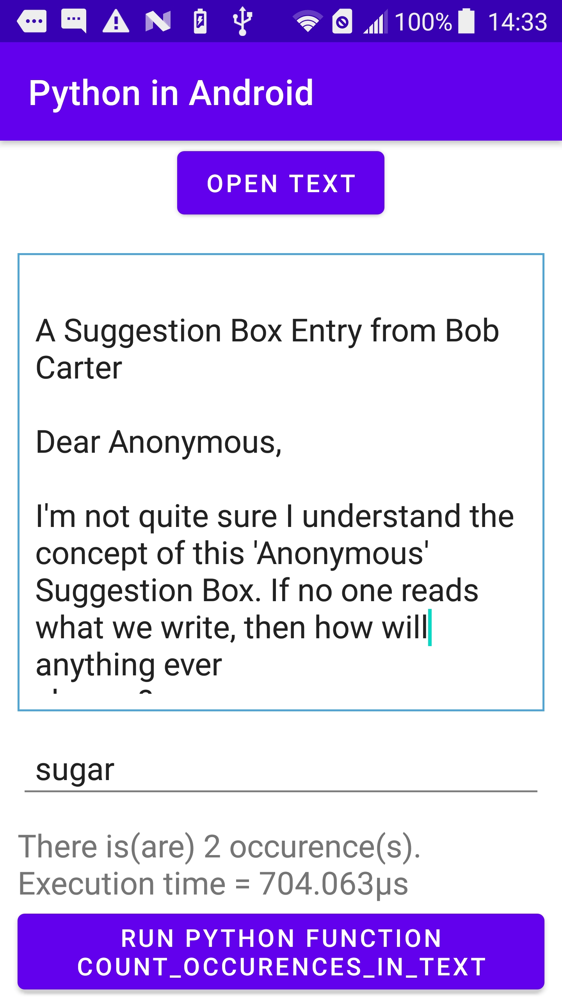
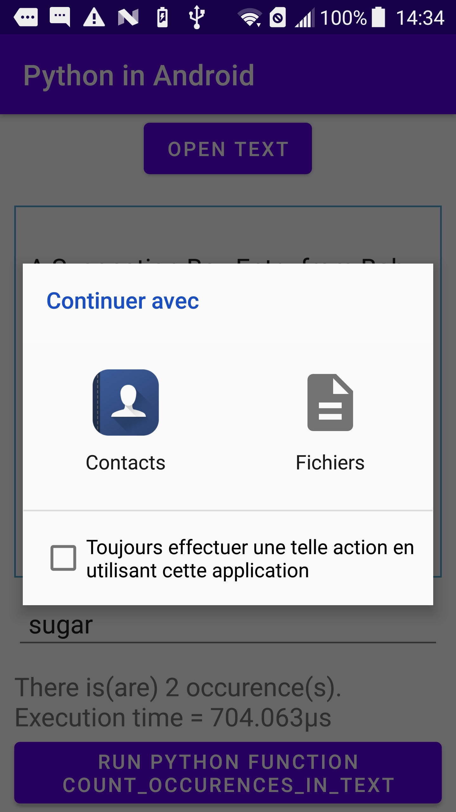
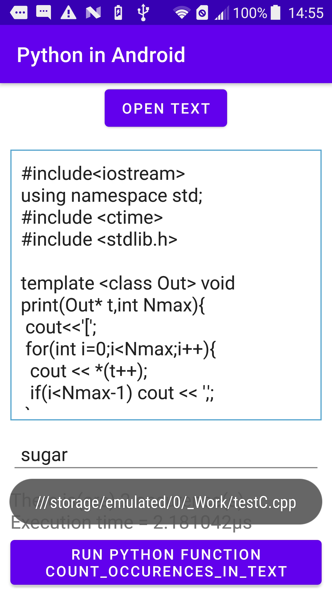
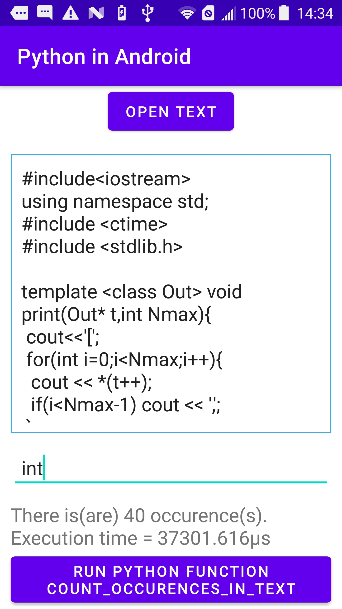

# Android-java_python

Testing python functions in java under android studio 4 using the plugin https://chaquo.com.

Find a word (or phrase) in the text (it can be read from a file) using the python function:

   

A license is required to use chaquopy!

# Author Alexander V. Korovin [a.v.korovin73@gamil.com]
